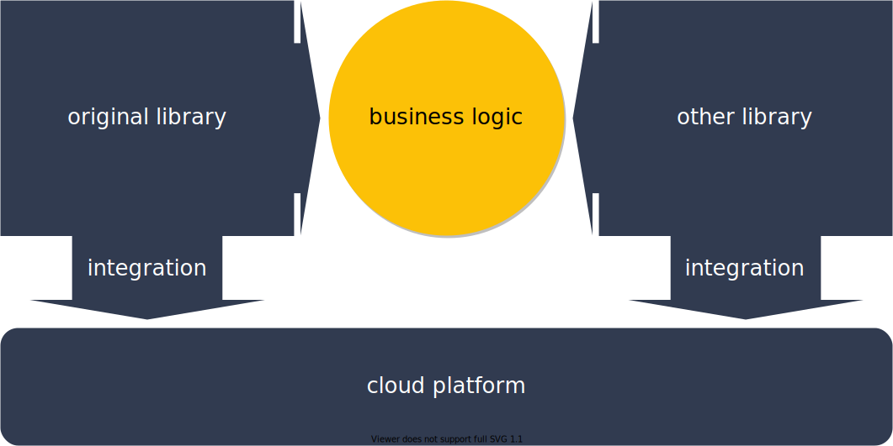
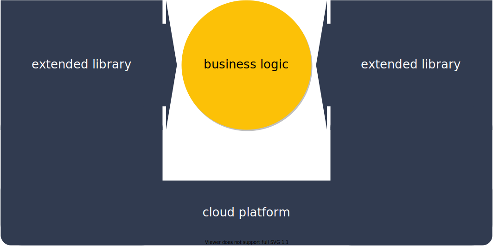

---
hide:
    - navigation
---

#



__Making software for a cloud requires two vectors business-logic & cloud integration codding.__

## Framework

Cloud Application Framework is a fleet of well-known software libraries which was been extended by cloud related methods.

Cloud Application Framework's libraries already contain integration tools, so it gives developers opportunities to work with business-logic only.

=== "origin"

    

=== "cloud application framework"

    

For example, we extend the popular pydantic.BaseModel object that uses for validating a data structure on methods which provide a single line code solution for saving data to Google Cloud Storage or sending PubSub messages, etc.

## SkyANT

SkyANT now includes libraries inherited from [Plotly Dash](https://dash.plotly.com){target=_blank}, [Pydantic](https://docs.pydantic.dev){target=_blank}, [FastAPI](https://fastapi.tiangolo.com){target=_blank}, [Dask](https://dask.org){target=_blank}, [Selenium](https://selenium.dev/){target=_blank}, [PyScript](https://pyscript.net){target=_blank}, [Odoo](https://odoo.com){target=_blank} & work with [Google Cloud Platform](https://cloud.google.com){target=_blank}.

We emphasise libraries for data engineering and visualisation and making ML models.

SkyANT contains:

- extended software libraries

- docker containers for running software in a cloud

- scripts and snippets for deploying software
