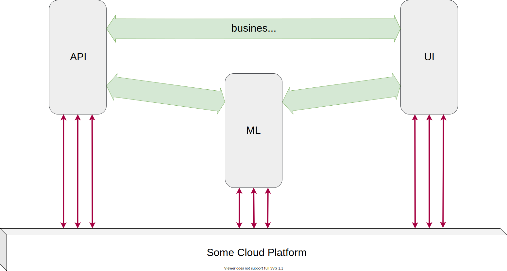
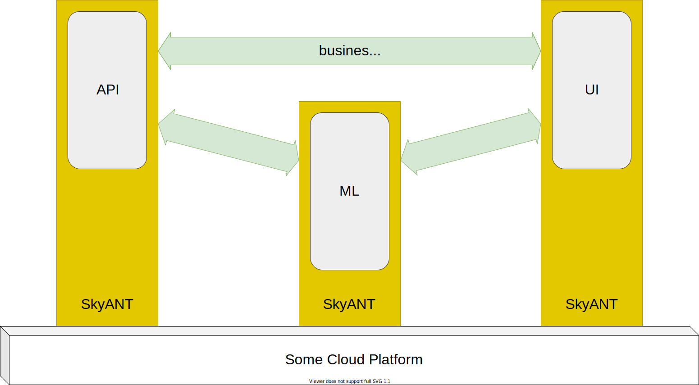

---
hide:
    - footer
    - navigation
---

#

Developing cloud applications requires not only applications' subject skills but also experience in working in a cloud environment. It increases a barrier to entry.

SkyANT provides solutions for decreasing a barrier to entry and makes cloud infrastructure more nearly to software developers.

## Vision

The classic strategy of development prescribes a working in two directions:

1. business logic

2. interaction with cloud

The SkyANT strategy give to developers opportunities to work with business logic only.

We develop not a single library but extend many different existing libraries to integrate them into cloud providers (Google Cloud, AWS, etc.).

For example, we extend the popular pydantic.BaseModel object that uses for validating a data structure on methods which provide a single line code solution for saving data to Google Cloud Storage or sending PubSub messages, etc.

=== "classic"

    

=== "micro-application framework"

    

We emphasise libraries for data engineering and visualisation and making ML models.

## Framework

SkyANT contains:

- extended software libraries

- docker containers for running software in a cloud

- scripts and snippets for deploying software
